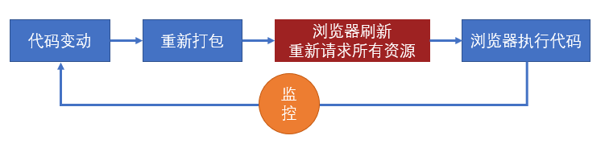

# webpack(4-5)

## 安装webpack

``` 

npm
npm install webpack webpack-cli
yarn
yarn add webpack webpack-cli
```

---

## webpack模块引入原理

``` 

(funcrtion(modules){
    var installedModules = {};
    function __webpack_require__(moduleId){
        <!-- 缓存 -->
        if(installedModules[moduleId]){
           return installedModules[moduleId].exports;
        }
        <!-- 创建一个module -->
        var module =  installedModules[moduleId] = {
            <!-- 模块名 -->
            i:moduleId,
            <!-- 模块是否加载完毕 -->
            l:false,
            exports:{}
        }
        modules[moduleId].call(module.exports,module,module.exports,__webpack_require__);
        module.l = true;
        return module.exports;
    }
    return __webpack_require__("./src/index")
}({
    "./src/index.js":(function(module,module.__webpack_exports__,__webpack_require__){
        __webpack_require__("./src/user.js");
        <!-- 使用eval的好处，方便调试避免当代码报错的时候报错显示的是编译合并压缩后的代码杂乱看不懂 -->
        <!-- //# sourceURL=webpack:///./src/index.js? 指定报错后的文件地址指引，会将代码归纳到webpack文件下的src目录下的index.js中 -->
        eval("xxxxx //# sourceURL=webpack:///./src/index.js?")
    }),
    "./src/user.js":(function(module,module.__webpack_exports__,__webpack_require__){
        const a = "1";
       __webpack_exports__["default"] = a;
    })
}))
```

---

### devtool配置

#### source map(源码地图)

> 本知识点与webpack无关

**解决的问题**

> 解决调试的问题，显示源码中的错误而不是编译转换后的代码中的错误

**最佳实践**

1. source map应该在开发环境中使用，作为一种调试手段
2. source map不应该在生产环境中使用，不仅导致额外的网络传输还容易暴露原始代码

#### webpack中的source map

[webpack配置:devtool文档](https://v4.webpack.docschina.org/configuration/devtool/)
**devtool配置**

``` 

module.exports = {
    mode:"development",
    devtool:"none"   //关闭源码地图
    devtool:"eval"   //默认值,原理就是使用eval运行模块中的代码
    devtool:"eval-source-map"   //生成源码地图展示真实代码
}
```

---

### webpack编译过程

#### 初始化

融合配置

#### 编译

创建chunk

#### 输出

---

### 输入输出

``` 

module.exports = {
    entry:"",  //打包入口
    output:""  //打包出口
}
```

* **entry(入口)**

``` 

写法一:
entry:"./src/index"  //默认值
写法二:
多个chunk
entry:{
    chunkName:"./src/index",
    user:"./src/user"
}
写法三:
一个chunk 多个入口
entry:{
    chunkName:["./src/index","./src/user"]  
}
```

* **output(出口)**

``` 

    output:{
        path:path.resolve(__dirName,"dist"),  //这里必须是绝对路劲
        filename:"xxx",  //文件名
        filename:"[name].[hash:4].[chunkHash]" //name为chunkname，hash为总的hash值，chunkHash为每个chunk的hash值，hash:4 表示取hash值中的前四位
    }
```

* **当项目内容发生变化则hash值发生改变，否则无变化, hash值一般用来解决浏览器缓存问题**

---

### loader

#### 作用

> loader 用于对模块的源代码进行转换  [loader的概念](https://v4.webpack.docschina.org/concepts/loaders/)

#### 用法

``` 

module.exports = {
    module:{
        rules:[
            {
                test:/\.css$/,   //使用正则匹配文件后缀名
                use:"style-loader"  //写法一
                use:[style-loader,"css-loader"]  //写法二 当存在多个loader的时候执行顺序从右到左
                use:[
                    {
                        loader:"style-loader"   //写法三
                    }
                ]
            }
        ]
    }
}
```

#### 自定义loader

``` 

    <!-- 自定义loader   loaders/css-loader.js-->
    module.exports = function(params){
        return "";
    }
    <!-- webpack.config.js -->
    module.exports = {
        module:{
            rules:[
                {
                    test:"/\.css$/",
                    <!-- 使用自定义loader -->
                    use:["./loaders/css-loader.js"]
                }
            ]
        }
    }
```

---

### plugin

#### 作用

> webpack 插件是一个具有 **apply** 方法的 JavaScript 对象。apply 方法会被 webpack compiler 调用，并且 compiler 对象可在整个编译生命周期访问

> 在webpack打包运行的时候会执行导出的插件，并在apply方法中注册事件，待到达特定时机触发事件执行相应的处理

#### 用法

[tapable类, 提供了插件类型](https://v4.webpack.docschina.org/api/plugins/#tapable)

> 这个类暴露 tap, tapAsync 和 tapPromise

1. **tap** 以同步方式触及 compile 钩子
2. **tapAsync** 以异步方式触及 run 钩子

3. 

``` 

<!-- 声明自定义插件 plugins/myPlugin.js-->
module.exports = class MyPlugin {
    constructor(params) {
   
    }
    <!-- 插件必须存在一个apply方法 -->
    <!-- webpack打包运行时会执行该插件的apply方法 -->
    apply(compiler){
        <!-- 注册事件 -->
        <!-- Tapable类 -->
    
        compiler.hooks.事件名.tap("",(compilation)=>{
            <!-- 事件回调 -->
        })
    }
}
<!-- 引入自定义插件 -->
const MyPlugin = require("./plugins/myPlugin");
module.exports = {
    mode:"development",
    plugins:[
        new MyPlugin(xxx);
    ]
}
```

---

### 环境配置

#### 方法一

``` 

<!-- package.json -->
scripts:{
"dev":"webpack --mode=development"
}
```

#### 方法二

``` 

<!-- webpack.config.js -->
module.exports = {
    mode:"development"
}
```

#### 方法三

``` 

<!-- package.json -->
scripts:{
"dev":"webpack --env mode=development"
}
<!-- webpack.config.js -->
module.exports = (env)=>{
    if(env.mode==="development"){
        <!-- 环境为开发环境 -->
    }
}
```

#### --env写法

1. --env development

``` 

获取到的env参数为：
{
    development:true
}
```

2. --env mode=development

``` 

获取到的env参数为：
{
    mode:development
}
```

**注意mode=development中间不能出现空格，如:mode= development**

### 其他细节配置

#### context

> 基础目录，绝对路径，用于从配置中解析入口点(entry point)和 加载器(loader)

``` 

module.exports = {
    context:path.resolve(__dirName,"src")
}
```

#### output.library

[output.library ](https://webpack.docschina.org/configuration/output/#outputlibrary)

* 将打包的结构暴露给变量abc, 可以通过访问abc获取打包结果

#### output.libraryTarget

[output.libraryTarget ](https://webpack.docschina.org/configuration/output/#outputlibrarytarget)

*  配置如何暴露 library

### target

> 构建的目标环境，构建好的文件是在什么环境运行

``` 

{
    target:"web" // 默认值
    target:"node" //node环境  解析fs，path等node内置模块的时候不回去解析依赖
}
```

### module.noParse

> 对配置的模块不进行解析(提高打包效率)

``` 

module.exports =  {
    module:{
        rules:[], //loader
        noParse:/a\.js$/  //不对a模块对任何操作，直接将源代码放置到模块内容中
    }
}
```

#### resolve.modules

> 模块的查找位置, 当遇到require("vant")的时候, 会在当前目录查找**node_modules**文件如果没有会去上级目录查找依次循环没找到就会报错, 这里控制的就是查找的文件夹默认值是**node_modules**

``` 

module.exports = {
    resolve:{
        modules:["node_modules"]  //默认值
    }
}
```

#### resolve.extensions

> 当解析模块时，遇到无具体后缀的导入语句，例如require("test"), 会依次测试它的后缀名

``` 

module.exports = {
    resovle:{
        extensions:[".js",".json"] // 默认值
    }
}
```

* 当导入模块没有书写后缀名的时候，更具默认配置[".js", ".json"]先查找.js的文件没有在找.json在没有就找不到模块了

#### resolve.alias

> 别名, 类似vue中的@别名

``` 

module.exports = {
    resolve:{
        alias:{
            "@":path.resolve(__dirName,"src")
        }
    }
}
```

#### externals

> 配置webpack不需要导入的模块，例: 页面引入了jquery但是是通过cdn引入所以页面中依赖的jq不需要导入到打包模块中

``` 

module.exports = {
    externals:{
        <!-- 忽略的模块名:导出的内容 -->
        jquery:"$",
        lodash:"_"
    }
}
```

#### stats

> 控制命令行的输出

[stats配置](https://webpack.docschina.org/configuration/stats/)

### 常用扩展

#### clean-webpack-plugin

> 插件 清除打包时的文件

#### html-webpack-plugin

> 插件 打包的时候自动生成html页面

#### copy-webpack-plugin

> 插件 复制文件

#### webpack-dev-server

开启本地服务器
 

``` json
 {
     "scripts":{
        "dev":"webpack-dev-server"
        }
 }
 ```

 **开启服务器代理**
 

``` js
    module.exports = {
        devServer: {
            port: 8080, //设置端口
            open: true,
            proxy: {
                "/api": {
                    target: "https://read.douban.com", //代理的地址
                    changeOrigin: true, //默认情况下，代理时会保留主机头的来源，可以将 changeOrigin 设置为 true 以覆盖此行为
                    secure: true //默认情况下，将不接受在 HTTPS 上运行且证书无效的后端服务器。 如果需要，可以这样修改配置
                }
            }
        }
    }
```

#### file-load

> 生成依赖的文件到输出目录，然后将模块文件设置为：导出一个路径

``` js
 module.exports = {
     module: {
         rules: [{
             test: /\.(png)|(gif)|(jpg)$/,
             use: [{
                 loader: "file-loader",
                 options: {
                     name: "[name].[hash:5].[ext]"
                     name: "img/[name].[hash:5].[ext]"
                 }
             }]
         }]
     }
 }
```

#### url-load

> 将依赖的文件转换为: 导出一个base64格式的字符串, 内部会使用file-loader, 当url-loader无法处理不了的时候会交给file-loader, options配置中可以写file-loader和url-loader的配置

 

``` js
 module.exports = {
     module: {
         rules: [{
             test: /\.(png)|(gif)|(jpg)$/,
             use: [{
                 loader: "url-loader",
                 options: {
                     limit: false //不限制任何大小，所有经过loader的文件进行base64编码返回
                     limit: 100 * 1024 //只要文件不超过100*1024字节则使用base64，否则，交给file-loader处理
                 }
             }]
         }]
     }
 }
```

#### webpack内置插件

##### definePlugin

> 定义全局常量, js中可以直接使用, webpack在编译的时候会替换

``` js
const webpack = require("webpack");
module.exports = {
    plugins: [
        new webpack.DefinePlugin({
            PI: `Math.PI`
        })
    ]
}
```

##### ProvidePlugin

> 自动引入模块, 遇到页面中使用该模块会自动引入模块，没有使用则不会处理

``` js
const webpack = require("webpack");
module.exports = {
    plugins: {
        new webpack.ProvidePlugin({
            $: "jquery",
            _: "lodash"
        })
    }
}
```

## css工程化

**解决重复样式的方案**

1. css in js
2. 预编译器scss,less
3. css  module

> 开启css module后

``` js
module.exports = {
    module: {
        rules: [{
            test: /\.css$/,
            // 开启css module
            // use: ["style-loader", "css-loader?module"]
            use: ["style-loader", {
                loader: "css-loader",
                options: {
                    module: true //开启css module
                }
            }]
        }]
    }
}
```

#### 抽离Css

##### mini-css-extract-plugin

``` js
const MiniCssExtractPlugin = require("mini-css-extract-plugin")
module.exports = {
    output: {
        // 解决因为将打包文件放入文件夹后出现的资源引入错误问题
        punlicPath: "/"
    },
    module: {
        rules: [{
            test: /\.css$/,
            use: [MiniCssExtractPlugin.loader, "css-loader"]
        }]
    },
    plugins: [
        new MiniCssExtractPlugin({
            filename: "css/xxx.css"
        })
    ]
}
```

### babel

> 巴别塔象征统一的国度，统一的语言

#### babel的安装

``` 

@babel/core:babel核心库，提供了编译所需的所有api
@babel/cli:提供一个命令行工具，调用核心库的api完成编译
```

#### babel的使用

``` npm
babel 要编译的文件 -o 编译后的结果
babel 要编译的整个目录 -d 编译结果放置的目录
```

#### .babelrc配置文件

``` json
{
    "presets":[],  //预设
    "plugins":[]   //插件
}
```

#### babel预设

* @babel/preset-env

> 让你可以使用最新的js语法，而无需针对每种语法设置具体的转换的插件

* 兼容的浏览器

> @babel/preset-env需要根据兼容的浏览器范围来确定如何编译，和postcss一样，可以使用文件.browserslistrc来描述浏览器的兼容范围

```browserslistrc 
last 3 version

> 1%

not ie <= 8

``` 

* 修改预设默认值

>**useBuiltIns**:false(默认值)  设置成false的时候babel处理js的时候只会编译新的语法，而不会注入新的api,将其设置成**usage**后表示根据api的使用情况，按需导入api
```json
{
    "presets":["@babel/preset-env",{
        "useBuiltIns":"usage",
        "corejs": 3   //告诉要使用的corejs的版本默认是2 目前是最新版3
        // 需要安装开发依赖 npm install core-js
    }],  //预设
}
```

* 补充安装(对@babel/preset-env预设补充)
1. core-js  提供api
2. regenerator-runtime 使用async时需要

#### babel插件

* 插件在presets前运行
* 插件顺序从前往后排列
* preset顺序是颠倒的(从后往前)

> 通常情况下, @babel/preset-env **只转换**那些已经形成**正式标准**的语法，对于某些处于**早期阶段**还没有确定的语法**不做转换**, 如果要**转换这些语法**, 就要使用**插件**

##### `@babel/plugin-proposal-class-properties`

> 该插件可以让你在类中书写初始化字段

``` js
class A {
    a = 1;
    constructor() {
        this.b = 3
    }
}
```

##### `@babel/plugin-proposal-optional-chaining`

> 安全性判断语法糖(这不是es规范中的语法糖)，内部实现就是无限三目运算符嵌套

``` js
const obj = {
    foo: {
        bar: {
            baz: 42
        }
    }
}

const baz = obj?.foo?.bar?.baz; //42
const safe = obj?.qux?.baz; //undefined
```

##### `babel-plugin-transform-remove-console`

> 该插件会移出源码中的控制台输出语句

##### `@babel/plugin-transform-runtime`

> 用于提供一些公共的api, 避免转换后多个页面使用相同的代码实现，安装此库可从库中引入一些公共的api

* `需要安装@babel/runtime`

#### babel与webpack结合使用

### 性能优化

#### 构建性能

1. `主要关注开发阶段的构建性能,提高开发效率，而不用关注生成环境的构建性能`

2. `降低从打包开始，到代码效果呈现所经过的时间`

#### 传输性能 

1. `总传输量，所有需要传输的js文件的内容加起来，就是总传输量，重复代码越少，总传输量越少`
2. `文件数量：当访问页面是，需要传输的js文件数量，文件数量越多，http请求越多，响应速度越慢`
3. `浏览器缓存：js文件会被浏览器缓存，被缓存的问题不会在进行传输`

#### 运行性能

1. `主要取决于高性能的代码`

**<span style="color:red">永远不要过早关注于性能<span/>**

#### 优化loader性能

1. 限制loader的使用范围

``` js
 module: {
     rules: [
         test: /\.js$/,
         exclude: "/lodash/", //设置忽略的目录
         include: ["/src/"], //设置解析的目录
         use: ["babel-loader"]
     ]
 }
```

2. 缓存loader结果

**cache-loader**

> 安装cache-loader并将cache-loader放在最前面，会将编译后的内容缓存之后编译就会直接使用，所以第一次编译会比较慢

``` js
 module: {
     rules: [
         test: /\.js$/,
         use: ["cache-loader", "babel-loader"]
     ]
 }
```

3. 开启loader运行开启多线程

**thread-loader**

> 安装thread-loader将loader放在需要开启线程处理的loader的前面

``` js
 module: {
     rules: [
         test: /\.js$/,
         use: ["cache-loader", "thread-loader", "babel-loader"]
         //  babel-loader将会在新的线程中处理
     ]
 }
```

#### 热替换

> 热替换并不能降低构建时间(可能还会稍微增加)，但可以降低代码改动到效果呈现的时间

当使用webpack-dev-server时，考虑代码改动到效果呈现的过程



而使用了热替换后，流程发生了变化


##### 使用和原理

1. 更改配置

``` js
module.exports = {
    devServer: {
        hot: true // 开启HMR
    },
    plugins: [
        // 可选
        new webpack.HotModuleReplacementPlugin()
    ]
}
```

2. 更改代码

``` js
// index.js
if (module.hot) { // 是否开启了热更新
    module.hot.accept() // 接受热更新
}
```

首先，这段代码会参与最终运行！

当开启了热更新后， `webpack-dev-server` 会向打包结果中注入 `module.hot` 属性

默认情况下， `webpack-dev-server` 不管是否开启了热更新，当重新打包后，都会调用 `location.reload` 刷新页面

但如果运行了 `module.hot.accept()` ，将改变这一行为

`module.hot.accept()` 的作用是让 `webpack-dev-server` 通过 `socket` 管道，把服务器更新的内容发送到浏览器


然后，将结果交给插件 `HotModuleReplacementPlugin` 注入的代码执行

插件 `HotModuleReplacementPlugin` 会根据覆盖原始代码，然后让代码重新执行

**所以，热替换发生在代码运行期**

##### 样式热替换

对于样式也是可以使用热替换的，但需要使用 `style-loader`

因为热替换发生时， `HotModuleReplacementPlugin` 只会简单的重新运行模块代码

因此 `style-loader` 的代码一运行，就会重新设置 `style` 元素中的样式

而 `mini-css-extract-plugin` ，由于它生成文件是在**构建期间**，运行期间并会也无法改动文件，因此它对于热替换是无效的

#### 分包

> 分包属于传输性能优化

**什么是分包**
 `分包是将一个整体的代码，分布到不同的打包文件中`

 **为什么要分包**

1. `减少公共代码，降低总体积， 特别是一些大型的第三方库`
2. `充分利用浏览器缓存`

**什么时候要分包**

1. 多个chunk引入了公共模块
2. 公共模板体积大或较少的变动

**如何分包**

1. 手动分包
2. 自动分包

> 例子: 当项目中存在两个chunk而且分别都引入了公共模板jquery, 在webpack打包过程中会导致两个chunk的打包文件都会去引入jquery的源码增加打包文件的体积, 因为两个chunk都是引入的相同的公共模块所以完全可以将jquery的代码分出来两个文件只需要引入这个文件的即可

#### 手动分包

##### 基本原理

手动分包的总体思路是：

1. 先单独的打包公共模块


公共模块会被打包成为动态链接库(dll Dynamic Link Library)，并生成资源清单

2. 根据入口模块进行正常打包

打包时，如果发现模块中使用了资源清单中描述的模块，则不会形成下面的代码结构

``` js
//源码，入口文件index.js
import $ from "jquery"
import _ from "lodash"
_.isArray($(".red"));
```

由于资源清单中包含 `jquery` 和 `lodash` 两个模块，因此打包结果的大致格式是：

``` js
(function(modules) {
    //...
})({
    // index.js文件的打包结果并没有变化
    "./src/index.js": function(module, exports, __webpack_require__) {
        var $ = __webpack_require__("./node_modules/jquery/index.js")
        var _ = __webpack_require__("./node_modules/lodash/index.js")
        _.isArray($(".red"));
    },
    // 由于资源清单中存在，jquery的代码并不会出现在这里
    "./node_modules/jquery/index.js": function(module, exports, __webpack_require__) {
        module.exports = jquery;
    },
    // 由于资源清单中存在，lodash的代码并不会出现在这里
    "./node_modules/lodash/index.js": function(module, exports, __webpack_require__) {
        module.exports = lodash;
    }
})
```

##### 打包公共模块

打包公共模块是一个**独立的**打包过程

1. 单独打包公共模块，暴露变量名

``` js
// webpack.dll.config.js
module.exports = {
    mode: "production",
    entry: {
        jquery: ["jquery"],
        lodash: ["lodash"]
    },
    output: {
        filename: "dll/[name].js", //打包到dist目录
        library: "[name]" //暴露的变量名
    }
};
```

2. 利用`DllPlugin`生成资源清单

``` js
// webpack.dll.config.js
module.exports = {
    plugins: [
        new webpack.DllPlugin({
            path: path.resolve(__dirname, "dll", "[name].manifest.json"), //资源清单的保存位置
            name: "[name]" //资源清单中，暴露的变量名
        })
    ]
};
```

运行后，即可完成公共模块打包

##### 使用公共模块

1. 在页面中手动引入公共模块

``` html
<script src="./dll/jquery.js"></script>
<script src="./dll/lodash.js"></script>
```

2. 重新设置`clean-webpack-plugin`

如果使用了插件 `clean-webpack-plugin` ，为了避免它把公共模块清除，需要做出以下配置

``` js
new CleanWebpackPlugin({
    // 要清除的文件或目录
    // 排除掉dll目录本身和它里面的文件
    // **/* 匹配所有目录下的所有文件
    // !dll 忽略dll目录
    // !dll/* 忽略dll目录下的所有文件
    cleanOnceBeforeBuildPatterns: ["**/*", '!dll', '!dll/*']
})
```

> 目录和文件的匹配规则使用的是[globbing patterns](https://github.com/sindresorhus/globby#globbing-patterns)

3. 使用`DllReferencePlugin`控制打包结果

``` js
module.exports = {
    plugins: [
        new webpack.DllReferencePlugin({
            manifest: require("./dll/jquery.manifest.json")
        }),
        new webpack.DllReferencePlugin({
            manifest: require("./dll/lodash.manifest.json")
        })
    ]
}
```

##### 总结

**手动打包的过程**：

1. 开启`output.library`暴露公共模块
2. 用`DllPlugin`创建资源清单
3. 用`DllReferencePlugin`使用资源清单

**手动打包的注意事项**：

1. 资源清单不参与运行，可以不放到打包目录中
2. 记得手动引入公共JS，以及避免被删除
3. 不要对小型的公共JS库使用

**优点**：

1. 极大提升自身模块的打包速度
2. 极大的缩小了自身文件体积
3. 有利于浏览器缓存第三方库的公共代码

**缺点**：

1. 使用非常繁琐
2. 如果第三方库中包含重复代码，则效果不太理想

#### 自动分包

#### 单模块体积优化

1. 代码压缩
2. tree shaking(过滤无用的代码)

#### 代码压缩
